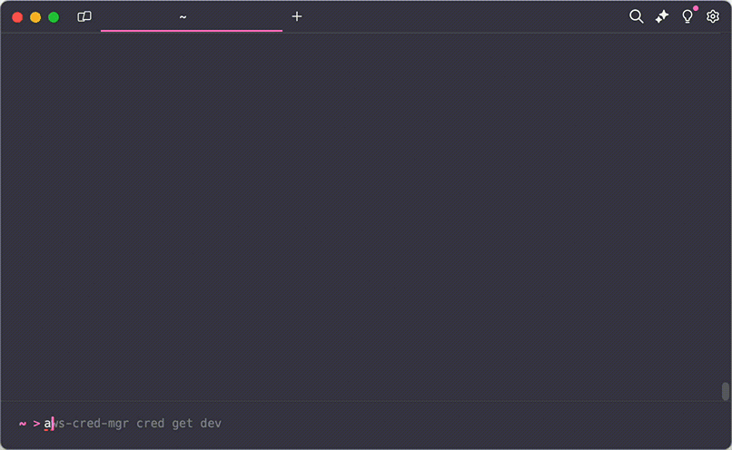

# AWS Credential Manager (aws-cred-mgr)

 

AWS Credential Manager (`aws-cred-mgr`) is a command-line interface (CLI) tool designed to simplify the management of local AWS credentials (including AWS RDS), especially for users authenticating with Okta. This utility offers a seamless experience for configuring Okta authentication, creating and managing AWS credential profiles, and handling RDS tokens effectively.

## Features

- **Okta Authentication**: Easily setup Okta authentication for you user
- **Credential Management**: Create and list AWS credentials, manage profiles with ease.
- **RDS Token Management**: Obtain RDS passwords for your databases securely.

### [Request new features here](https://github.com/ellosoft/aws-cred-mgr/issues/new?assignees=vgmello-ellosoft&labels=enhancement&projects=&template=feature_request.md&title=%5BFEATURE%5D)

## Demo



## Installation

### MacOS

```bash
curl https://raw.githubusercontent.com/ellosoft/aws-cred-mgr/main/scripts/install-aws-cred-mgr.sh | bash
```

### Windows

```cmd
winget install ellosoft-aws-cred-mgr
```

#### PowerShell (in case winget is blocked by your organization)

```powershell
iwr -useb https://raw.githubusercontent.com/ellosoft/aws-cred-mgr/main/scripts/install-aws-cred-mgr.ps1 | iex
```

### Manual

You can manually install `aws-cred-mgr` by downloading the latest version from the [GitHub Release](https://github.com/ellosoft/aws-cred-mgr/releases) page.

> [!Note]
> On Linux or MacOs systems you need to make the binary executable before you can use it. You can do this by running `chmod +x aws-cred-mgr` in the terminal.

## Usage

### Okta Configuration

```plaintext
aws-cred-mgr okta setup
```

#### Examples

- Simply run `aws-cred-mgr okta setup` to use interactive mode.
- Set up with domain and username: `aws-cred-mgr okta setup -d https://xyz.okta.com -u john --mfa push`

### Credential Management

```plaintext
aws-cred-mgr cred [COMMAND]
```

#### Subcommands

- `new`: Create a new credential profile.
- `get`: Get AWS credentials for an existing credential profile
- `list` (alias `ls`): List all saved credential profiles.

#### Examples

- Create a new credential profile named `prod`: `aws-cred-mgr cred new prod`
- List credentials: `aws-cred-mgr cred ls`
- Get the AWS credentials for `prod` and stores it in ~/.aws/credentials: `aws-cred-mgr cred get prod`

### RDS Token Management

```plaintext
aws-cred-mgr rds [COMMAND]
```

#### Examples

- Get RDS password : `aws-cred-mgr rds pwd`
- Get RDS password for `prod_db`: `aws-cred-mgr rds pwd prod_db`
- Get RDS password with all options: `aws-cred-mgr rds pwd -h localhost -p 5432 -u john`

### Config Files

```plaintext
aws-cred-mgr config
```

#### Examples

- Open user config: `aws-cred-mgr config`
- Open AWS credentials file: `aws-cred-mgr config aws`

### Configuration

The `config` section in the YAML file allows you to set global tool configurations:

- `copy_to_clipboard`: When set to `true`, the tool will automatically copy generated passwords to the clipboard. Default is `true`.
- `aws_ignore_configured_endpoints`: When set to `true`, the tool will ignore any pre-configured AWS endpoints. This can be useful in certain network environments. Default is `true`.

## Security Note for Windows and macOS Users

On Windows systems, `aws-cred-mgr` securely stores your Okta credentials using the Data Protection API (DPAPI).
This ensures that your sensitive information is encrypted and can only be accessed by your user account on your computer.

On macOs systems, `aws-cred-mgr` securely stores your Okta credentials using the native Keychain API.

Linux support is still under development

## Full Configuration Example

You can specify additional variables, templates, credentials, and RDS configurations in the YAML file `aws_cred_mgr.yml` located in your home folder

```yaml
variables:
    rds_username: my.user
    default_pwd_lifetime: 15
    # any variable can be specified here
---
authentication:
    okta:
        default: # default Okta profile name, additional profiles can also be created
            okta_domain: https://xyz.okta.com/
            preferred_mfa_type: push
            auth_type: classic

credentials:
    my_aws_dev_account: # credentials can be interactively created with `aws-cred-mgr cred new`
        role_arn: arn:aws:iam::123:role:/my_aws_role_arn
        aws_profile: default
        okta_app_url: https://xyz.okta.com/home/amazon_aws/abc/272
        okta_profile: default
    ...

templates:
    rds:
        orders_db: # templates can be created to simply configurations
            hostname: rds-hostname.aws.endpoint
            port: 5432
            username: ${rds_username} # variable usage
            region: us-east-2
        ...

environments:
    dev:
        credential: my_aws_dev_account
        rds:
            orders_db:
                hostname: dev.endpoint # overrides the template value
                template: orders_db
            products_db:
                hostname: rds-hostname.aws.endpoint
                port: 5432
                username: ${rds_username}
                ttl: ${default_pwd_lifetime}
                region: us-east-2
                credential: products_db # override env credential
    test:
        credential: my_aws_dev_account
        rds:
            orders_db:
                hostname: test.endpoint
                template: orders_db
    ...

# config:
#    copy_to_clipboard: true
#    aws_ignore_configured_endpoints: true
```

## Support

If you encounter any issues or require assistance, please open an issue on the project's GitHub page.

## Contribution

Contributions are welcome! Please fork the repository and submit a pull request with your changes or improvements.

> Note: I know I don't have unit tests, I'm working on it...

## Code of Conduct

[](.github/CODE_OF_CONDUCT.md)

This project has adopted the code of conduct defined by the Contributor Covenant to clarify expected behavior in our community. For more information see the [Code of Conduct](.github/CODE_OF_CONDUCT.md).

## Credits and Acknowledgements

`aws-cred-mgr` makes use of several open-source libraries. We extend our gratitude to the developers and contributors of these libraries:

- **[AngleSharp](https://github.com/AngleSharp/AngleSharp)**: A .NET library for parsing, manipulating, and rendering HTML and CSS documents.
- **[AWSSDK](https://github.com/aws/aws-sdk-net)**: The official AWS SDK for the .NET Framework.
- **[Serilog.Extensions.Logging](https://github.com/serilog/serilog-extensions-logging)**: An extension to `Microsoft.Extensions.Logging` that integrates Serilog.
- **[Serilog.Sinks.File](https://github.com/serilog/serilog-sinks-file)**: A Serilog sink that writes log events to text files.
- **[Spectre.Console](https://github.com/spectreconsole/spectre.console)**: A library for building command line interfaces.
- **[YamlDotNet](https://github.com/aaubry/YamlDotNet)**: A .NET library for YAML serialization and deserialization.

Each of these libraries may be licensed differently, so we recommend you to review their licenses if you plan to use `aws-cred-mgr` in your own projects.

## Trademarks

This repository makes use of libraries and technologies related to AWS (Amazon Web Services) and Okta.
Please note that “AWS” and “Amazon Web Services” are trademarks or registered trademarks of Amazon.com, Inc. or its affiliates.
Similarly, “Okta” is a trademark or registered trademark of Okta, Inc. All other trademarks and registered trademarks are the property
of their respective owners.

This repository is not affiliated with, endorsed by, or sponsored by Amazon.com, Inc., Okta, Inc.,
or any of their subsidiaries or affiliates. The use of these names is solely for descriptive purposes to identify the relevant technologies.

## License

This project is licensed under the terms of the MIT license.
