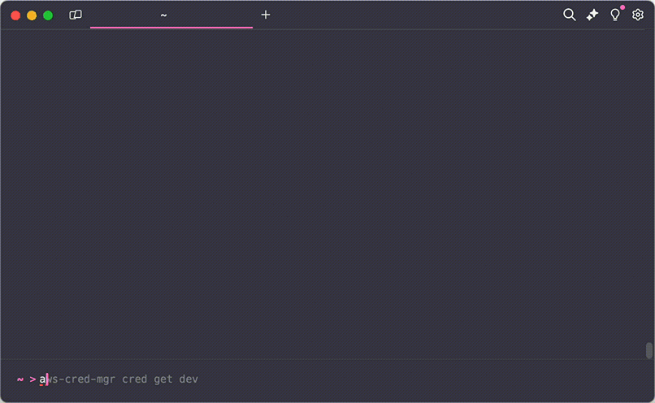

# AWS Credential Manager (aws-cred-mgr)

[](https://sonarcloud.io/summary/overall?id=ellosoft_aws-cred-mgr&branch=main)


AWS Credential Manager (`aws-cred-mgr`) is a command-line interface (CLI) tool designed to simplify the management of local AWS credentials (including AWS RDS), especially for users authenticating with Okta. This utility offers a seamless experience for configuring Okta authentication, creating and managing AWS credential profiles, and handling RDS tokens effectively.

## Features

- **Okta Authentication**: Easily setup Okta authentication for you user (Okta Verify push, TOTP code or Okta FastPass)
- **Credential Management**: Create and list AWS credentials, manage profiles with ease.
- **RDS Token Management**: Obtain RDS passwords for your databases securely.

### [Request new features here](https://github.com/ellosoft/aws-cred-mgr/issues/new?assignees=vgmello-ellosoft&labels=enhancement&projects=&template=feature_request.md&title=%5BFEATURE%5D)

## Demo



## Installation

### MacOS

```bash
curl https://raw.githubusercontent.com/ellosoft/aws-cred-mgr/main/scripts/install-aws-cred-mgr.sh | bash
```

### Windows

```cmd
winget install ellosoft-aws-cred-mgr
```

#### PowerShell (in case winget is blocked by your organization)

```powershell
iwr -useb https://raw.githubusercontent.com/ellosoft/aws-cred-mgr/main/scripts/install-aws-cred-mgr.ps1 | iex
```

### Manual

You can manually install `aws-cred-mgr` by downloading the latest version from the [GitHub Release](https://github.com/ellosoft/aws-cred-mgr/releases) page.

> [!Note]
> On Linux or MacOs systems you need to make the binary executable before you can use it. You can do this by running `chmod +x aws-cred-mgr` in the terminal.

## Usage

### Okta Configuration

```plaintext
aws-cred-mgr okta setup
```

#### Examples

- Simply run `aws-cred-mgr okta setup` to use interactive mode.
- Set up with domain and username: `aws-cred-mgr okta setup -d https://xyz.okta.com -u john --mfa push`
- Set up using Okta FastPass (Okta Verify desktop app): `aws-cred-mgr okta setup -d https://xyz.okta.com -u john --mfa fastpass`

#### MFA types

| `--mfa` value      | Stored as             | Behaviour                                                                                  |
|--------------------|-----------------------|--------------------------------------------------------------------------------------------|
| `push`             | `push`                | Sends an Okta Verify push notification to your phone                                       |
| `totp` / `code`    | `token:software:totp` | Asks for the 6 digit code from Okta Verify                                                 |
| `fastpass`         | `signed_nonce`        | Uses the **Okta Verify desktop app** on this machine (Okta FastPass), no phone required     |

#### Okta FastPass (Okta Verify desktop app)

With `--mfa fastpass` the MFA step is completed by the **Okta Verify desktop app** installed on the same machine
(macOS and Windows), so there is no push notification or code to type: Okta Verify prompts you to approve the sign-in
with **Touch ID / Windows Hello** (or the device PIN/password, depending on your org's policy) and signs the challenge
with the device-bound key. This is the same phishing-resistant flow the Okta sign-in page uses.

How it works:

1. `aws-cred-mgr` starts an Okta Identity Engine sign-in with your username and password.
2. Okta issues a FastPass device challenge and `aws-cred-mgr` asks Okta to open the **Okta Verify app** on this
   device (a `com-okta-authenticator://` link, the same as the "Open Okta Verify" button on the Okta sign-in page).
   Okta Verify comes to the foreground with the approval prompt; it does not need to be running beforehand.
3. If Okta does not offer to open the app, the challenge is delivered to Okta Verify through its local loopback
   server (`http://localhost:<port>`) instead, exactly like the Okta sign-in page does.
4. Okta Verify asks you to approve (biometrics/PIN), `aws-cred-mgr` waits for Okta to confirm and then continues
   with the AWS role selection / credential retrieval as usual.

Requirements and troubleshooting:

- Your Okta org must be on **Okta Identity Engine** and this device must be enrolled in Okta Verify with FastPass
  enabled by your Okta admin (Classic Engine orgs get a clear error suggesting `push`/`totp`).
- Okta Verify must be installed on this device; if the app does not open, make sure it is installed and try again.
- The login times out after 2 minutes waiting for approval; simply rerun the command.
- Run any command with the hidden `--log-level debug` option to write detailed diagnostics (including the Okta
  responses) to `~/.aws_cred_mgr/aws-cred-mgr.log` when reporting issues.

### Credential Management

```plaintext
aws-cred-mgr cred [COMMAND]
```

#### Subcommands

- `new`: Create a new credential profile.
- `get`: Get AWS credentials for an existing credential profile
- `list` (alias `ls`): List all saved credential profiles.

#### Examples

- Create a new credential profile named `prod`: `aws-cred-mgr cred new prod`
- List credentials: `aws-cred-mgr cred ls`
- Get the AWS credentials for `prod` and stores it in ~/.aws/credentials: `aws-cred-mgr cred get prod`
- Force renew AWS credentials even if the current session is still valid: `aws-cred-mgr cred get prod --force-renew`

### RDS Token Management

```plaintext
aws-cred-mgr rds [COMMAND]
```

#### Examples

- Get RDS password : `aws-cred-mgr rds pwd`
- Get RDS password for `prod_db`: `aws-cred-mgr rds pwd prod_db`
- Get RDS password with all options: `aws-cred-mgr rds pwd -h localhost -p 5432 -u john`
- Force renew the underlying AWS session before generating an RDS password: `aws-cred-mgr rds pwd prod_db --force-renew`

### Config Files

```plaintext
aws-cred-mgr config
```

#### Examples

- Open user config: `aws-cred-mgr config`
- Open AWS credentials file: `aws-cred-mgr config aws`

### Configuration

The `config` section in the YAML file allows you to set global tool configurations:

- `copy_to_clipboard`: When set to `true`, the tool will automatically copy generated passwords to the clipboard. Default is `true`.
- `aws_ignore_configured_endpoints`: When set to `true`, the tool will ignore any pre-configured AWS endpoints. This can be useful in certain network environments. Default is `true`.

## Security Note for Windows and macOS Users

On Windows systems, `aws-cred-mgr` securely stores your Okta credentials using the Data Protection API (DPAPI).
This ensures that your sensitive information is encrypted and can only be accessed by your user account on your computer.

On macOs systems, `aws-cred-mgr` securely stores your Okta credentials using the native Keychain API.

Linux support is still under development

## Full Configuration Example

You can specify additional variables, templates, credentials, and RDS configurations in the YAML file `aws_cred_mgr.yml` located in your home folder

```yaml
variables:
    rds_username: my.user
    default_pwd_lifetime: 15
    # any variable can be specified here
---
authentication:
    okta:
        default: # default Okta profile name, additional profiles can also be created
            okta_domain: https://xyz.okta.com/
            preferred_mfa_type: push # also: totp | code | fastpass (Okta Verify desktop app, stored as signed_nonce)
            auth_type: classic

credentials:
    my_aws_dev_account: # credentials can be interactively created with `aws-cred-mgr cred new`
        role_arn: arn:aws:iam::123:role:/my_aws_role_arn
        aws_profile: default
        okta_app_url: https://xyz.okta.com/home/amazon_aws/abc/272
        okta_profile: default
    ...

templates:
    rds:
        orders_db: # templates can be created to simply configurations
            hostname: rds-hostname.aws.endpoint
            port: 5432
            username: ${rds_username} # variable usage
            region: us-east-2
        ...

environments:
    dev:
        credential: my_aws_dev_account
        rds:
            orders_db:
                hostname: dev.endpoint # overrides the template value
                template: orders_db
            products_db:
                hostname: rds-hostname.aws.endpoint
                port: 5432
                username: ${rds_username}
                ttl: ${default_pwd_lifetime}
                region: us-east-2
                credential: products_db # override env credential
    test:
        credential: my_aws_dev_account
        rds:
            orders_db:
                hostname: test.endpoint
                template: orders_db
    ...

# config:
#    copy_to_clipboard: true
#    aws_ignore_configured_endpoints: true
```

## Support

If you encounter any issues or require assistance, please open an issue on the project's GitHub page.

## Contribution

Contributions are welcome! Please fork the repository and submit a pull request with your changes or improvements.

> Note: I know I don't have unit tests, I'm working on it...

## Code of Conduct

[](.github/CODE_OF_CONDUCT.md)

This project has adopted the code of conduct defined by the Contributor Covenant to clarify expected behavior in our community. For more information see the [Code of Conduct](.github/CODE_OF_CONDUCT.md).

## Credits and Acknowledgements

`aws-cred-mgr` makes use of several open-source libraries. We extend our gratitude to the developers and contributors of these libraries:

- **[AngleSharp](https://github.com/AngleSharp/AngleSharp)**: A .NET library for parsing, manipulating, and rendering HTML and CSS documents.
- **[AWSSDK](https://github.com/aws/aws-sdk-net)**: The official AWS SDK for the .NET Framework.
- **[Serilog.Extensions.Logging](https://github.com/serilog/serilog-extensions-logging)**: An extension to `Microsoft.Extensions.Logging` that integrates Serilog.
- **[Serilog.Sinks.File](https://github.com/serilog/serilog-sinks-file)**: A Serilog sink that writes log events to text files.
- **[Spectre.Console](https://github.com/spectreconsole/spectre.console)**: A library for building command line interfaces.
- **[YamlDotNet](https://github.com/aaubry/YamlDotNet)**: A .NET library for YAML serialization and deserialization.

Each of these libraries may be licensed differently, so we recommend you to review their licenses if you plan to use `aws-cred-mgr` in your own projects.

## Trademarks

This repository makes use of libraries and technologies related to AWS (Amazon Web Services) and Okta.
Please note that “AWS” and “Amazon Web Services” are trademarks or registered trademarks of Amazon.com, Inc. or its affiliates.
Similarly, “Okta” is a trademark or registered trademark of Okta, Inc. All other trademarks and registered trademarks are the property
of their respective owners.

This repository is not affiliated with, endorsed by, or sponsored by Amazon.com, Inc., Okta, Inc.,
or any of their subsidiaries or affiliates. The use of these names is solely for descriptive purposes to identify the relevant technologies.

## License

This project is licensed under the terms of the MIT license.
